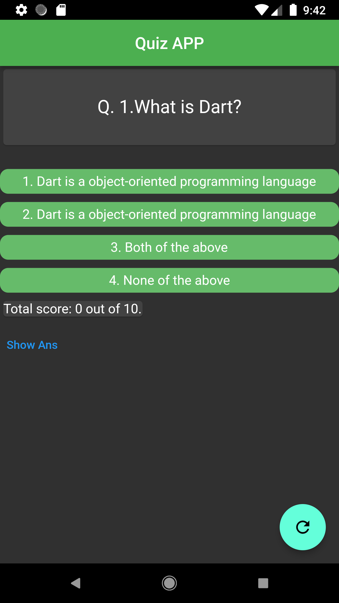
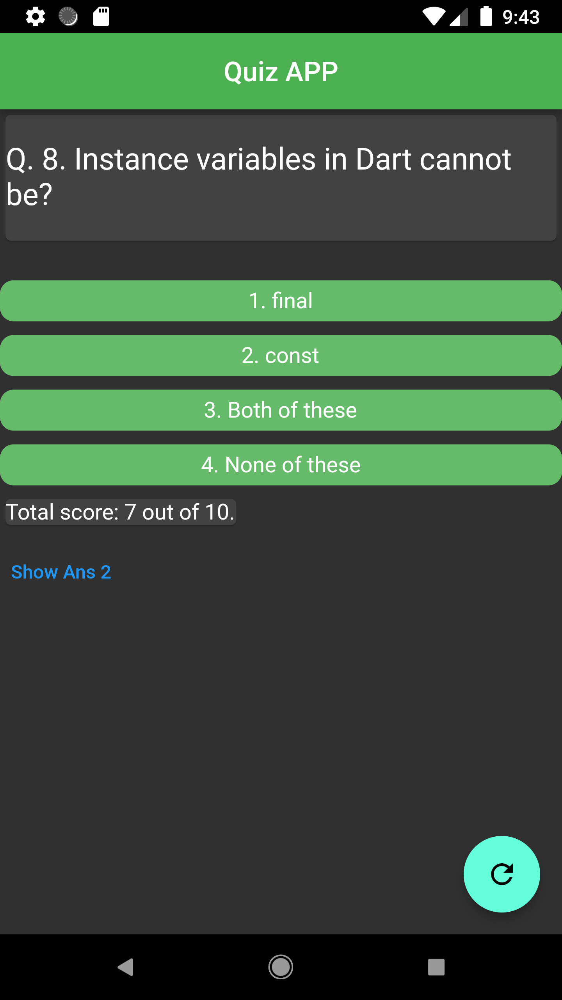
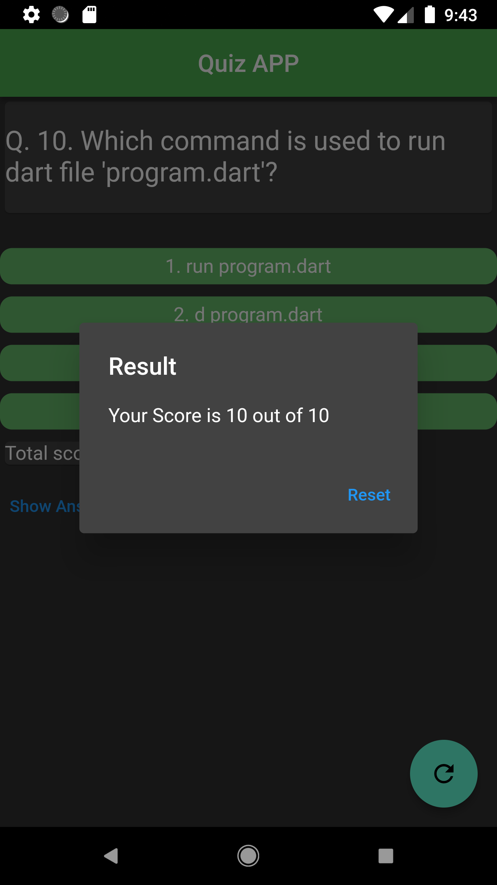

# quizapp

This is a Flutter Quiz App,  wtih following features:
1. Ten multiple-choice questions from question.dart model file.
2. Each question has four button-based selectable options.
3. Each question's score will be determined show immediately.
4. Show answer text button that shows correct options for a given questions.
5.  A floating action button for reset quiz and display Dialog after quiz finishes.

